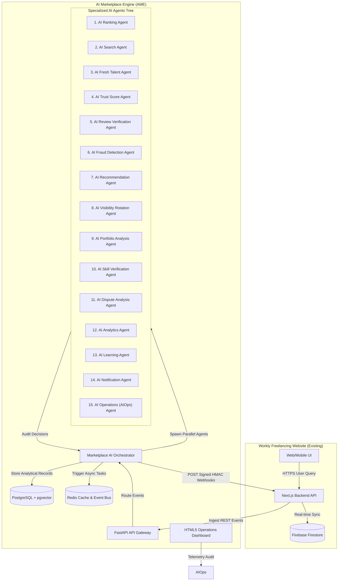
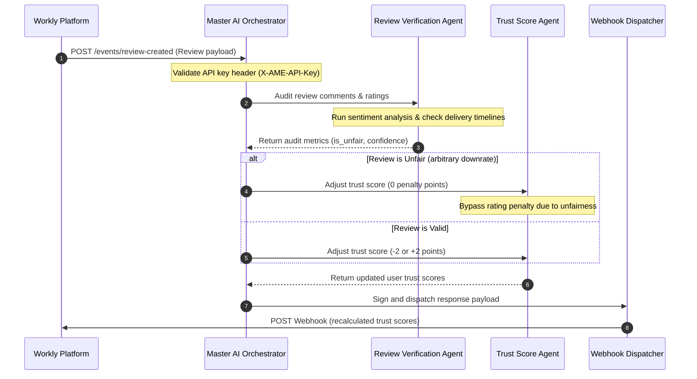
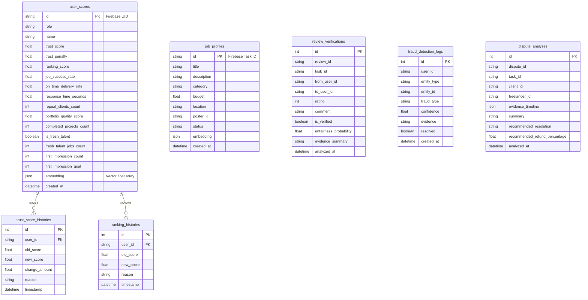

# AI Marketplace Engine (AME) — Master System Documentation

This document serves as the authoritative guide for the **AI Marketplace Engine (AME)**, a modular, independent, and high-performance AI subsystem designed specifically for fixed-price task marketplaces.

---

## 1. System Architecture Overview

The AI Marketplace Engine operates as a completely decoupled microservice that communicates with the main freelancing website exclusively via **REST APIs**, **secure Webhooks**, and **Redis Event Streams**. 

### 1.1 Microservices Integration Blueprint



---

## 2. Event Sequence & Lifecycle Flows

The Orchestrator coordinates agent execution upon receiving events from the marketplace.

### 2.1 Double-Blind Review Completion Flow

This flowchart illustrates how the Review Verification Agent, Trust Agent, and Orchestrator execute in sequence when a review is submitted:



---

## 3. Database Entity Relationship Diagram (ERD)

The database schema stores user performance attributes, trust audit timelines, disputes evidence, and operational telemetry.



---

## 4. Operational Specifications of the 15 AI Agents

### 4.1 AI Ranking Agent
Calculates the search listing score. **Important:** Proposal quality or AI-generated bidding checks have 0% weight.
$$\text{Rank Score} = (\text{JSR} \times 0.3) + (\text{Trust Score} \times 0.3) + (\text{Portfolio Quality} \times 0.2) + (\text{On-Time Delivery} \times 0.1) + (\text{Repeat Clients Boost} \times 0.05) + (\text{Response Speed} \times 0.05)$$

### 4.2 AI Search Agent
Translates string queries into 1536 float arrays. Performs cosine comparisons inside PostgreSQL with a fallback to local Python NumPy logic if the `pgvector` extension is not compiled.

### 4.3 AI Fresh Talent Agent
Grants newly registered freelancers a temporary +15 ranking points bump. Guarantees 1,000 search page impressions (`first_impression_goal`) and rotates priority dynamically.

### 4.4 AI Trust Score Agent
Maintains scoring bounded between 0.0 and 100.0. Penalty adjustments apply: -10 for cancellations, -15 for active disputes, and -20 for off-platform escrow bypass details.

### 4.5 AI Review Verification Agent
Evaluates negative feedback. Bypasses trust score deductions and job success penalties for reviews flagged as unfair.

### 4.6 AI Fraud Detection Agent
NLP regex analysis scans messaging for phone numbers, email handles, or payment terms (PayPal, wire transfer) to block escrow leakage. It also runs portfolio image hashing checks to flag plagiarized items.

### 4.7 AI Recommendation Agent
Content-based recommendation mapping. Matches open tasks to freelancers based on category and skills overlap.

### 4.8 AI Visibility Rotation Agent
Uses an epsilon-greedy algorithm (10% exploration threshold). Shuffles the bottom-tier list back into search results to avoid platform visibility monopolies.

### 4.9 AI Portfolio Analysis Agent
Grades profiles on description completeness, links, and project file attachments.

### 4.10 AI Skill Verification Agent
Validates stated expertise by checking completed order counts and durations against standard technology taxonomies.

### 4.11 AI Dispute Analysis Agent
Parses milestones completed against deadlines missed. Proposes refund allocations (e.g., 60% client refund, 40% provider payout) for human admin review.

### 4.12 AI Analytics Agent
Synthesizes system operations, including click-through rates (CTR) on matching results, API request times, and fraud cases.

### 4.13 AI Learning Agent
Updates JSR ratios and ranking parameters after successful projects.

### 4.14 AI Notification Agent
Dispatches security warning messages and ranking alerts.

### 4.15 AI Operations (AIOps) Agent
Tracks system telemetry (CPU cores, memory leaks, thread pool depths) and triggers alerts if boundaries are exceeded.

---

## 5. Deployment Guide & Scaling

### 5.1 Docker Architecture
To deploy the engine locally:
1. Populate your environment variables inside the local `.env` configuration file.
2. Spin up containers in single-click mode:
   ```bash
   docker-compose up --build -d
   ```

### 5.2 Kubernetes Production Orchestration
Deploy AME onto a cloud cluster (GKE, EKS) with standard scaling setups:
```bash
# Apply settings
kubectl apply -f k8s/configmap.yaml
kubectl apply -f k8s/secret.yaml

# Run stateful database & redis deployment
kubectl apply -f k8s/deployment.yaml
```

---

## 6. Integration Guide for the Freelancing Website

To connect your existing Next.js / Firebase marketplace to AME, you only need to configure three elements:

### 6.1 Set Environment Variables
Add these to the Next.js `.env` configuration:
```env
AME_BASE_URL=http://your-ame-cluster-ip:8000
AME_API_KEY=workly_ame_secret_key
AME_WEBHOOK_SECRET=workly_ame_webhook_secret
```

### 6.2 Forward Events from Next.js
Whenever a relevant user action occurs, send the payload to AME:
```typescript
async function trackEvent(eventType: string, data: object) {
  const url = `${process.env.AME_BASE_URL}/api/events/${eventType}`;
  await fetch(url, {
    method: "POST",
    headers: {
      "Content-Type": "application/json",
      "X-AME-API-Key": process.env.AME_API_KEY as string
    },
    body: JSON.stringify(data)
  });
}
```

### 6.3 Securely Consume AME Webhook Decisions
Set up an endpoint at `/api/webhooks/ame` inside Next.js to receive callbacks. Verify the signature header using your `AME_WEBHOOK_SECRET`:
```typescript
import crypto from 'crypto';

export async function POST(req: Request) {
  const signature = req.headers.get("X-AME-Signature");
  const rawBody = await req.text();
  
  const expectedSignature = crypto
    .createHmac("sha256", process.env.AME_WEBHOOK_SECRET as string)
    .update(rawBody)
    .digest("hex");
    
  if (signature !== expectedSignature) {
    return new Response("Unauthorized signature", { status: 403 });
  }
  
  const payload = JSON.parse(rawBody);
  // Apply decisions directly to Firestore (e.g. update user's trustScore or ban user)
  return new Response("OK", { status: 200 });
}
```
